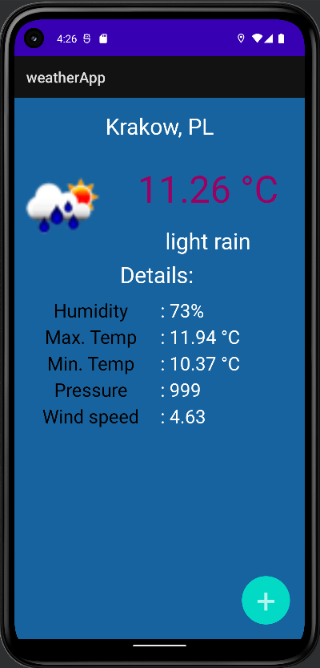
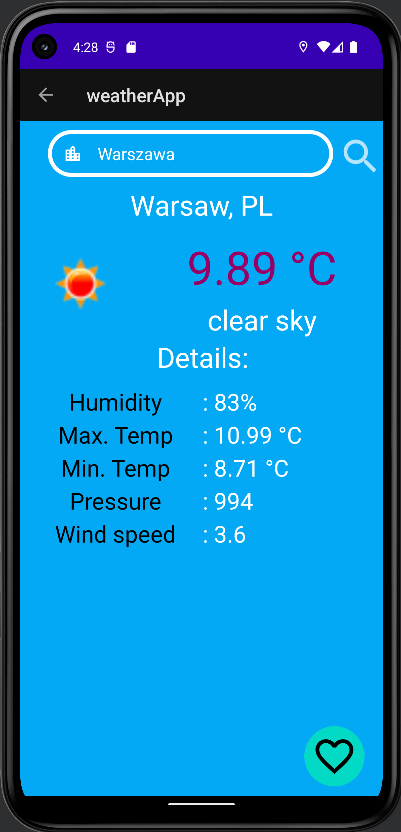

# weatherApp
Weather forecast app for Android made in Java that gets information from API using device's location. 
User can also search for weather in different location and save it as a "favourite" so it's later displayed as default.
 
